# MicroTPCT

***Microproteotypicity of Peptides – Computational Toolkit***

A computational toolkit designed to assess the proteotypicity of candidate microprotein peptides and resolve ambiguities in extended proteome analyses.

## Content

- [Description](#description)
- [Context](#context)
    - [Microproteins and alternative proteomes](#microproteins-and-alternative-proteomes)
    - [Microproteomics workflows and limitations](#microproteomics-workflows-and-limitations)
    - [False positives in two-step search strategies](#false-positives-in-two-step-search-strategies)
- [Features](#features)
    - [Short-query / long-target matching](#short-query--long-target-matching)
    - [Biological sequence-aware matching](#biological-sequence-aware-matching)
    - [Unified result model](#unified-result-model)
    - [Multiple user interfaces](#multiple-user-interfaces)
    - [Performance evaluation](#performance-evaluation)
- [Repository organization](#repository-organization)
- [Installation](#installation)
    - [Requirements (Python version, dependencies, OS)](#requirements-python-version-dependencies-os)
    - [Install from source](#install-from-source)
    - [Editable mode for developers](#editable-mode-for-developers)
        - [`pip install -e .`](#pip-install--e-)
    - [Install GUI](#install-gui)
        - [Windows](#windows)
        - [macOS](#macos)
        - [Linux](#linux)
- [Quick Start](#quick-start)
    - [CLI](#cli)
    - [GUI](#gui)
- [Core concepts](#core-concepts)
    - [Queries and targets](#queries-and-targets)
    - [QueryDB and TargetDB](#querydb-and-targetdb)
    - [Matching semantics: strict vs wildcard-aware](#matching-semantics-strict-vs-wildcard-aware)
    - [Matches and result aggregation](#matches-and-result-aggregation)
    - [Microproteotypicity assessment](#microproteotypicity-assessment)
    - [Pipeline overview](#pipeline-overview)
- [Validation and Benchmarks](#validation-and-benchmarks)
- [License](#license)
- [Authors and Affiliations](#authors-and-affiliations)


## Description

MicroTPCT is a framework that addresses the classical short-pattern / long-text matching problem supporting exact and wildcard-based matching with a unified result model.

The framework is primarily developed for peptide-to-protein matching in microproteomics, with an appropriate management of biological sequences, bioinformatics file reading and explicit support for ambiguous amino-acid symbols.

## Context

### Microproteins and alternative proteomes

Historically, an ORF was defined as a sequence starting with a START codon, ending with a STOP codon and having at least 100 codons. Shorter ORFs were usually ignored. However, since the 2010s, it has become apparent that small proteins, could also have important biological functions, for example in the regulation of key cellular processes, cell signaling or stress response. Their study is therefore particularly promising to better understand the functioning of cells and certain diseases.

Today, a new paradigm is emerging for the annotation of ORFs. In our work, we consider that an ORF can have a minimum size of 30 codons. The ORFs of 30 to 100 codons are called small-ORFs (smORFs), and the proteins from these smORFs are referred to here as microproteins. The set of microproteins is named alternative proteome.

### Microproteomics workflows and limitations

Due to the novelty of the field, there is not yet a standardized analysis strategy for the study of microproteins in proteomics. Similarly, no dedicated bioinformatics tool currently allows for specifically processing this type of data in large volumes.

A possible strategy for proteomic studies based on mass spectrometry is to perform a double analysis of the spectra, as opposed to a single analysis in the typical case. In a first step, the spectra of the injected peptides are matched to a database of canonical proteins, such as Uniprot, using tryptic search engines such as Mascot. In a second step, the spectra of unmatched peptides, i.e., those that do not belong to canonical proteins, are matched against a database of alternative proteins, including microproteins. The peptides found in the second step are peptides that potentially belong to microproteins. This two-step search workflow allows for control of the matching FDR.

### False positives in two-step search strategies

However, this method alone is not sufficient in the case of alternative in-vitro digestion of canonical peptides, rendering them semi-trypsic. These peptides, which are not matched in the first stage of the workflow, may, by chance, have a sequence identical to a trypsic microprotein peptide. In this case, the workflow identifies the peptides as belonging to a microprotein, even though the biological sample contained the canonical protein, creating a false positive.

MicroTPCT was developed precisely for the purpose of correcting these false positives by performing a robust and optimized text search of a list of peptides against a reference proteome. MicroTPCT allows users to systematically verify whether candidate peptides uniquely map to microproteins or also occur in canonical proteomes. From a computational perspective, this corresponds to large-scale matching of short peptide sequences against long protein sequences under controlled matching constraints.

## Features

### Short-query / long-target matching

- Efficient matching of collections of short peptide sequences against long protein sequences
- Supports both strict (exact) and wildcard-aware matching
- Multiple exact matching algorithms implemented
- Custom wildcard-aware matching design to match short non-ambiguous patterns on long ambiguous sequence (containing wildcard)

### Biological sequence-aware matching

- Verification of biological consistency and validity of peptide and protein sequences
- Optimized for the specific characteristics of mass spectrometry analysis (e.g., handling the inability to differentiate between leucine and isoleucine in mass).
- Explicit support for ambiguous amino-acid symbols (e.g. X)
- Configurable wildcard definitions and matching behavior

### Unified result model

- Standardized representation of matching outcomes
- Clear distinction between strict matches, wildcard matches, and non-matches
- Aggregation of results at peptide and protein levels with interpretable metrics

### Multiple user interfaces

- Standalone graphical executable (Windows, MacOS, Linux Debian)
- A command line interface for terminal use and integration with bioinformatics workflows
- A Python package
- An interactive Jupyter notebook to understand the pipeline step by step and explore intermediate results.

### Performance evaluation

- Built-in tools to measure runtime, memory, and CPU usage of integrated algorithms
- Reproducible benchmarking across matching strategies and datasets
- Support for controlled experimental scenarios with a fully customizable dataset generator (e.g. dataset size, ambiguity level)

## Repository organization

The core implementation of MicroTPCT is located in the `src/` directory and contains the matching logic, data models, and result handling described above.

Benchmarking scripts are provided in the `benchmarks/` directory. They allow users to evaluate runtime, memory usage, and other performance metrics across different matching strategies, either on synthetic datasets or on user-provided data.

An interactive tutorial is available in the `notebooks/` directory. It is designed to introduce the conceptual workflow of MicroTPCT by running the pipeline step by step, inspecting intermediate objects, and enabling exploratory analyses beyond the default command-line pipeline.


## Installation

### Requirements (Python version, dependencies, OS)

Python version 3.12 or older is recommended

### Install from source

1. Clone the repository : 

```
git clone https://github.com/NoeCoursi/MicroTPCT.git
```

1. Create and activate a dedicated Python virtual environment (recommended) :
- Linux and macOS

```
python -m venv venv
source venv/bin/activate
```

- Windows

```bash
python -m venv venv
venv\Scripts\activate
```

1. Install Python dependencies : 

```
pip install -r requirements.txt
```

1. Install MicroTPCT

```
cd MicroTPCT
pip install .

# editable mode for developpers
# pip install -e .
```

### Install GUI

If you don't want to install Python or use the command line, you can download the ready-to-use graphical version:

**👉 Download the last release here : [LATEST](https://github.com/NoeCoursi/MicroTPCT/releases)**

#### Windows

- Download `MicroTPCT.exe`
- Double-click on it to launch the application.

#### macOS

- Download `MicroTPCT.app`
- Clic droit → **Ouvrir** (la première fois, macOS peut bloquer les apps non signées)

#### Linux

**Debian/Ubuntu `.deb` package**

- Download the latest `MicroTPCT.deb`
- Install it with:

```bash
sudo apt install ./MicroTPCT.deb
```

Launch MicroTPCT from the Applications menu or by typing `MicroTPCT` in the terminal.

**AppImage (Universal)**

- Download  `MicroTPCT.AppImage`

```bash
chmod +x MicroTPCT.AppImage
./MicroTPCT.AppImage
```

Double-click the AppImage luncher. Make sure it’s executable.

**Portable `.tar.gz`**

- Download `MicroTPCT-linux.tar.gz` from the Releases page
- Extract the archive and run the `MicroTPCT` binary:

```bash
tar -xzf MicroTPCT-linux.tar.gz
./MicroTPCT
```

## Quick Start

MicroTPCT can be used either as a Python package, through its command-line interface (CLI).

### CLI

First, set up the software on your machine and install dependencies.

```bash
microTPCT --start
```

Basic syntax

```bash
microTPCT [options] QUERY_input TARGET_input
```

- **QUERY_input**: file containing peptides
- **TARGET_input**: file containing the canonical proteome used as reference

Wildcard handling

`--allow_wildcard` Enable complementary regex searches for undetermined amino acids in the target file

A wildcard character **must** be specified when using this option.

Example : 

```
microTPCT --allow_wildcard X QUERY_input TARGET_input
```

Peptide matching strategies

Several matching algorithmes are available. If nothing is specified Aho-Corasick-rs is used by defaults.

```
microTPCT --aho QUERY_input TARGET_input
```

Other options

More options are availables. Please use `--help` to show a short usage summary or `--usage` to display all detailed usage informations.

```
microTPCT --usage
```

### GUI

MicroTPCT provides an optional graphical user interface (GUI) built with Tkinter, allowing users to run the peptide matching pipeline without using the command line.

Lauching the GUI

- run:

```bash
python -m microtpct.interfaces.gui
```

- Or lunch the executable software

Input files

- Selection of the target proteome (FASTA format)
- Selection of the query peptide file (CSV or Excel)
- Selection of the output directory

Configuration & save options

- Selection of the matching algorithm via a drop-down menu
- Optional wildcard matching with user-defined wildcard character
- Output format selection:
    - Excel (.xlsx)
    - CSV (.csv)
- Custom output filename with optional timestamp

Actions

Run Pipeline = launches the analysis

Clear = resets all inputs to default values

Exit = closes the application

## Core concepts

### Queries and targets

MicroTPCT is built around a clear separation between **queries** and **targets**.

- **Queries** are short sequences, typically peptides identified by mass spectrometry we want to control the microproteotipicity.
- **Targets** are long reference sequences, typically protein sequences from canonical proteomes.

This short-query / long-target asymmetry reflects the core computational problem addressed by MicroTPCT and underlies all matching strategies implemented in the framework.

### QueryDB and TargetDB

Queries and targets are encapsulated in dedicated data structures:

- `QueryDB` stores peptide sequences along with their identifiers and optional metadata (eg. flag that indicates if they contains ambiguous amino-acids).
- `TargetDB` stores protein sequences and associated annotations.

These abstractions provide:

- consistent sequence validation,
- uniform access to sequence content,
- decoupling between biological data handling and matching algorithms.

Both `QueryDB` and `TargetDB` rely on unique identifiers to guarantee unambiguous sequence referencing and reproducibility, even in cases where multiple peptides originate from the same biological entity.

To handle mass spectrometry-induced ambiguities, leucine (L) and isoleucine (I) are normalized to a common symbol (J) in both peptide and protein sequences, ensuring consistent matching semantics.

### Matching semantics: strict vs wildcard-aware

MicroTPCT distinguishes two complementary matching modes:

- **Strict matching**, where peptide sequences must match target sequences exactly.
- **Wildcard-aware matching**, where specific characters (X in most of cases) representing ambigous amino-acids that can be any.

Both matching modes operate on the same query and target representations and provide the same results stucture, ensuring consistent result interpretation.

### Matches and result aggregation

Individual sequence alignments are represented as **matches**, which encode:

- the query identifier,
- the target identifier,
- the matching position(s),
- the matching mode used.

Matches are aggregated into a unified **result model**, enabling:

- clear distinction between strict matches, wildcard matches, and non-matches,
- aggregation at peptide and protein levels,
- computation of interpretable metrics for downstream analysis.

### Microproteotypicity assessment

In the context of microproteomics, MicroTPCT is used to assess the **microproteotypicity** of peptides.

A peptide is considered microproteotypic if it:

- matches microprotein sequences, (prior analysis by a search engine like Mascot, not managed by MicroTPCT)
- and does not match canonical protein sequences under defined matching constraints.

MicroTPCT does not perform peptide identification itself, but rather provides a post-processing step to evaluate whether candidate peptides can be confidently attributed to microproteins based on sequence matching.

### Pipeline overview

MicroTPCT implements the following workflow:

1. Read protein and peptide input files
2. Validate sequence integrity and detect ambiguous residues
3. Build optimized internal databases
4. Perform efficient strict exact matching
5. Perform optional wildcard-aware matching
6. Merge results and export summary tables

```mermaid
---
config:
  theme: neutral
  look: handDrawn
  layout: dagre
---
flowchart LR
    PROTEOME["PROTEOME"] --> READ["read files"]
    PEPTIDES["PEPTIDES"] --> READ
    READ --> VALIDATE1["validate proteins & flag wildcards"] & VALIDATE2["validate peptides"]
    VALIDATE2 --> QUERY_DB["Query DB"]
    VALIDATE1 --> TARGET_DB["Target DB"] & TARGET_DB.ONLY_WC["Wildcards target DB"]
    WC["🟧 if wildcards enabled and detected"] ~~~ TARGET_DB.ONLY_WC
    REGEX["Wildcard-aware match algo"] --> MATCH_RES_WC(["Wildcards matching results"])
    TARGET_DB --> MATCH["Match algo"]
    MATCH --> MATCH_RES(["Matching results"])
    WRITERS["Write outputs"] --> OUT1["matches.csv"] & OUT2["metrics.csv"]
    TARGET_DB.ONLY_WC --> REGEX
    QUERY_DB --> MATCH & REGEX
    MATCH_RES_WC --> WRITERS
    MATCH_RES --> WRITERS

    PROTEOME@{ shape: rounded}
    PEPTIDES@{ shape: rounded}
    QUERY_DB@{ shape: db}
    TARGET_DB@{ shape: cyl}
    TARGET_DB.ONLY_WC@{ shape: cyl}
    WC@{ shape: text}
    REGEX@{ shape: rect}
    MATCH@{ shape: rect}
    OUT1@{ shape: rounded}
    OUT2@{ shape: rounded}
     PROTEOME:::Class_01
     PEPTIDES:::Class_01
     TARGET_DB.ONLY_WC:::Class_02
     REGEX:::Class_02
     MATCH_RES_WC:::Class_02
     OUT1:::Class_03
     OUT2:::Class_03
    classDef Sky stroke-width:1px, stroke-dasharray:none, stroke:#374D7C, fill:#E2EBFF, color:#374D7C
    classDef Class_01 fill:#FFCDD2, color:#000000
    classDef Class_02 fill:#FFE0B2, color:#000000
    classDef Class_03 fill:#FFE0B2, color:#000000
    style WC color:#FF6D00
    style OUT1 fill:#C8E6C9
    style OUT2 fill:#C8E6C9
    linkStyle 6 stroke:#FF6D00,fill:none
    linkStyle 8 stroke:#FF6D00,fill:none
    linkStyle 13 stroke:#FF6D00,fill:none
    linkStyle 15 stroke:#FF6D00,fill:none
    linkStyle 16 stroke:#FF6D00,fill:none

```



## Validation and Benchmarks

We benchmarked several exact peptide-to-proteome matching algorithms implemented in MicroTPCT.

We evaluate execution time, CPU usage, peak memory consumption, and correctness in order to guide default algorithm selection and user-level configuration.

If you wish to compare performances of the different algorithms on your data we recommend you to go through the `match_engine_benchmark` jupyter notebook. 

The following algorithms are compared:

- Naive Python baseline (`str.find`) (reference method)
- Boyer–Moore
- Aho–Corasick (C++ backend)
- Aho–Corasick (Rust backend)
- System-level `grep + awk` launcher
- BLAST (included as a qualitative reference, not as a competitive exact matcher)

Our benchmarking highlighted that :

- The naive str.find implementation provides a reliable but slow baseline.
- Multi-pattern algorithms (Aho–Corasick) scale better with increasing numbers of queries.
- System-level tools (grep/awk) offer competitive performance with minimal memory overhead.
- BLAST, while functional for exact matching ones fine-tuned, is computationally overkill for exact peptide matching.

These results justify the default configuration of MicroTPCT and provide users with practical guidance for selecting an appropriate matching engine.

## License

This project is distributed under the terms of the MIT license.
For more details, please consult the [LICENSE](https://github.com/NoeCoursi/MicroTPCT/blob/main/LICENCE.txt) file or visit the official [page](https://opensource.org/license/MIT).

## Authors and Affiliations

From INP ENSAT — Agrotoulouse : 


Basile Bergeron
https://www.linkedin.com/in/basile-bergeron-4665aa259/

Meredith Biteau
https://www.linkedin.com/in/meredithbf/

Ambre Bordas	
https://www.linkedin.com/in/ambre-bordas-52b287254/

Noé Coursimaux	
https://www.linkedin.com/in/noe-coursimaux/

Ambroise Loeb	
https://www.linkedin.com/in/ambroiseloeb/

